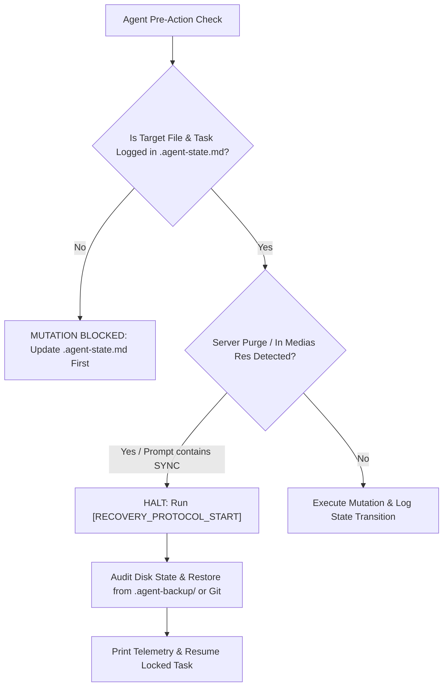

# Agent Context Guard

An autonomous, drop-in state persistence and crash recovery engine designed to counter the notorious **"The server cleared a prefix of the conversation as it grew too large."** context erasure events in Antigravity IDE (and long-running agent workflows).

---

## 💭 Background & Motivation

This system was created to counter the notorious "The server cleared a prefix of the conversation as it grew too large." of Antigravity IDE. Although it will likely have uses outside of Antigravity and the specific issues mentioned here, as a general Agentic work improvement measure so the Agent tracks and uses information on what it is doing more reliably.

They will never fix it (Google seems to have abandoned Antigravity development; it is a fork of VS Code but it has productivity killer issues including Agent amnesia after an "The server cleared a prefix of the conversation as it grew too large." event) and it never receives client updates.
I need to vent about killers like the lack of a 'Fork conversation' button in IDE chat, and the context erasure (by server) issue that wipes out the entire chat history for both user and Agent.

This system can alleviate those issues. Unfortunately, Google AI plans don't work with their real limits outside of Antigravity application/Antigravity IDE, so they lock us to a broken product led by a bad team.
The limits and Gemini as a model is good enough to try and stick with Antigravity, so workarounds will be needed.

---

## ⚡ The Technical Problem: Why Context Amnesia Happens

In extended agent pairing sessions, Antigravity IDE's server prunes earlier conversation turns to stay within context boundaries, outputting the banner:
> `(i) The server cleared a prefix of the conversation as it grew too large.`

When this occurs:
1. **The event is invisible to the model:** The UI banner is rendered on the client side, while the model is simply fed a truncated history array.
2. **Trajectory Momentum Hijack:** The model sees only its recent turns (e.g., compiling, fixing a syntax error) and rushes forward with code modifications without knowing its original instructions and constraints were erased.
3. **Token Churn Feedback Loop:** Naive guards that store raw full-file snapshots inside markdown prompts consume tens of thousands of tokens per edit—ironically accelerating conversation bloat and triggering context wipes even faster.

---

## 🛡️ The Solution: Continuous Deterministic State Guard

This system transforms prompt-based state tracking from passive suggestions into an **unconditional execution gate**:



### Core Components
| File | Role |
| :--- | :--- |
| **[`GEMINI.md`](GEMINI.md)** | **Continuous Execution Gate**: Enforces that the agent is strictly prohibited from calling code mutation tools (`replace_file_content`, `write_to_file`) or build commands unless actively synchronized with `.agent-state.md`. |
| **[`.crash-remediation.md`](.crash-remediation.md)** | **Purge Remediation Engine**: Detects server-side context purges via concrete *in medias res* conversation heuristics, manages atomic initialization, and conducts physical workspace integrity audits. |
| **[`.agent-state.md`](.agent-state.md)** | **External State Ledger**: Maintains immutable context fences, atomic milestones (`[x]`, `[~]`, `[ ]`), and lightweight references to disk backups (`.agent-backup/`) without burning prompt tokens. |

---

## 🎯 Recommendation: Should You Use It?

Before adding this guard to your workflow, consider your project requirements:

* **Recommended if:** You are working on long-running, multi-hour projects, complex refactors, or deep autonomous milestones where losing initial context leads to costly regressions and model drift.
* **Not necessary if:** You are doing exploratory coding, single-file scripts, or fast iterative tasks where high velocity is preferred.

---

## 🚀 Quick Start & Workspace Adoption

No Antigravity IDE settings modifications are required.

### Option A: Standalone Setup (New Workspaces)
Copy the repository's core files into your workspace root:
- `GEMINI.md`
- `.crash-remediation.md`
- `.agent-state.md`
- Add `.agent-backup/` to your `.gitignore` to keep `git status` clean.

### Option B: Adopting in an Existing Workspace
If you already have an established project:
1. Copy [`.crash-remediation.md`](https://raw.githubusercontent.com/Barrixar/agent-context-guard/main/.crash-remediation.md) and [`.agent-state.md`](https://raw.githubusercontent.com/Barrixar/agent-context-guard/main/.agent-state.md) to your workspace root.
2. Add `.agent-backup/` to your `.gitignore`.
3. Copy the header block (from `[CRITICAL_SYSTEM_LINK_START]` through `[CRITICAL_SYSTEM_LINK_END]`) from [`GEMINI.md`](https://raw.githubusercontent.com/Barrixar/agent-context-guard/main/GEMINI.md) to either:
   - The very top of your workspace's existing `GEMINI.md`, or
   - A dedicated rule file inside your workspace rules directory at `.agents/rules/` (e.g. `.agents/rules/context-guard.md`).

---

## 🔍 How Purge Recovery Works in Practice

1. **Autonomous "In Medias Res" Detection:**
   When the server truncates conversation history, the agent's visible history suddenly begins mid-stream (starting with an isolated compiler error or tool call without the original session prompt). The engine explicitly detects this signature and halts mutations immediately.

2. **One-Word User Triggers:**
   If you see the `The server cleared a prefix...` notification banner in your IDE chat, you can simply message:
   ```text
   SYNC
   ```
   or
   ```text
   RECOVER
   ```
   The agent will immediately suspend code editing, align with `.agent-state.md`, audit files on disk, and report back its verified status.

3. **Zero-Token Disk Backups (`.agent-backup/`):**
   Before major mutations, target files can be backed up to `.agent-backup/<filename>` or tracked via Git. Storing backups on disk rather than inline in markdown prompts saves up to 20,000+ tokens per turn, keeping conversations lean and postponing context truncation.

4. **Non-Git Workspace Resilience:**
   In workspaces that are not Git repositories (e.g., bare project directories), the guard automatically routes all rollback snapshots to the local `.agent-backup/` folder. This completely avoids `fatal: not a git repository` failures.

5. **Standardized Telemetry Report:**
   Upon recovery, the agent always prints a structured confirmation before resuming code mutations:
   ```text
   [CONTEXT_GUARD_TELEMETRY]
   * Workspace: TotalMayhem (C++ / MSBuild)
   * Engine State: SYNCHRONIZED
   * Active Milestone: [~] State 3: TransitBus member declaration
   * Audited Assets: src/Game/GameApp.cpp: VERIFIED_INTEGRAL
   * Next Authorized Mutation: Fix C2838 syntax qualification
   ```

---

## 📄 License
The Unlicense - Public Domain.
